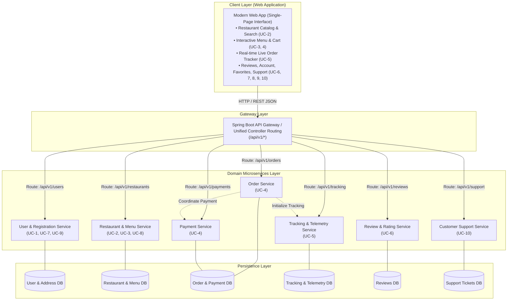
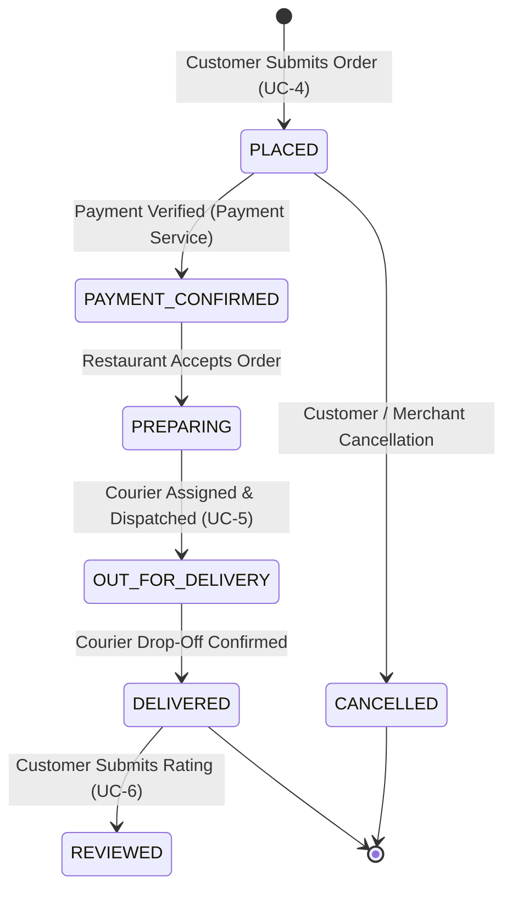
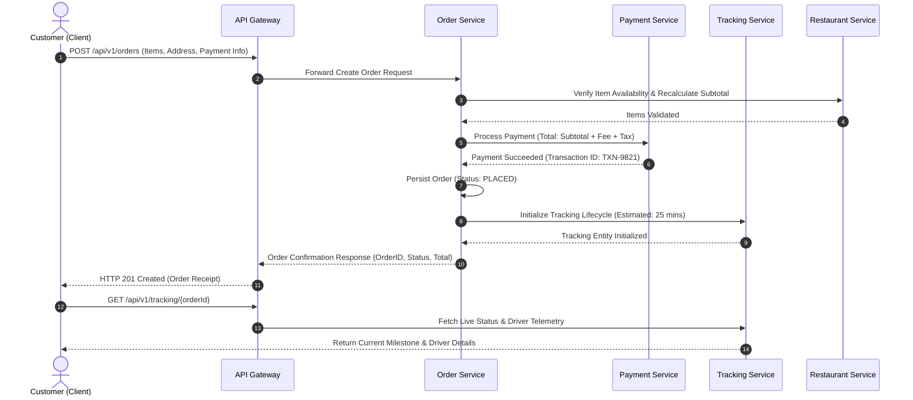

# System Architecture Document (SAD)
## Project Title: Food Delivery Microservices System

**Version:** 1.0.0  
**Backend Framework:** Java Spring Boot 4.x (Java 21/26 runtime)  
**Persistence:** Spring Data JPA + H2 in-memory DB / PostgreSQL profile  
**Frontend Framework:** Modern Vanilla ES2024 / HTML5 / CSS Design System  
**Pattern:** Domain-Driven Microservices with API Gateway & Event-Driven Progression

---

## 1. Architectural Overview & Topology

The system is engineered as a decoupled, resilient microservices ecosystem following Domain-Driven Design (DDD) principles. The architecture provides:
1. **API Gateway & Routing Layer**: Serves as the single entry point for all frontend client requests, managing CORS, request routing, rate limiting, and unified error handling.
2. **Domain Microservices**: 7 distinct domain-bounded microservice contexts implementing the 10 business use cases.
3. **Data Layer**: Isolated domain schemas with ACID transaction boundaries via Spring Data JPA.
4. **Event & State Management**: Order lifecycle state machine (`PLACED` $\rightarrow$ `PREPARING` $\rightarrow$ `OUT_FOR_DELIVERY` $\rightarrow$ `DELIVERED`) with real-time tracking polling / SSE updates.

---

## 2. Order Lifecycle State Machine

---

## 3. Order Placement Sequence Diagram (UC-4, UC-5)

---

## 4. Domain Microservices Breakdown

### 4.1 `UserService` (Bounded Context: Identity & Customer Accounts)
- **Use Cases Covered**: UC-1 (Registration), UC-7 (Account Management), UC-9 (Delivery Addresses).
- **Core Entities**:
  - `User`: `id`, `name`, `email`, `phone`, `passwordHash`, `avatarUrl`, `createdAt`.
  - `Address`: `id`, `userId`, `label` (Home, Work, Other), `street`, `suite`, `city`, `state`, `zipCode`, `isDefault`.

### 4.2 `RestaurantService` (Bounded Context: Catalog, Menus & Discovery)
- **Use Cases Covered**: UC-2 (Restaurant Search), UC-3 (View Menu), UC-8 (Favorites).
- **Core Entities**:
  - `Restaurant`: `id`, `name`, `cuisine`, `rating`, `reviewCount`, `deliveryTimeMinutes`, `deliveryFee`, `minOrderAmount`, `imageUrl`, `address`, `isOpen`.
  - `MenuItem`: `id`, `restaurantId`, `name`, `category` (Starters, Mains, Desserts, Drinks), `description`, `price`, `imageUrl`, `isVegetarian`, `isSpicy`, `isAvailable`.
  - `FavoriteRestaurant`: `id`, `userId`, `restaurantId`, `savedAt`.

### 4.3 `OrderService` & `PaymentService` (Bounded Context: Commercial Transactions)
- **Use Cases Covered**: UC-4 (Place Order & Process Payment).
- **Core Entities**:
  - `Order`: `id`, `userId`, `restaurantId`, `status` (`PLACED`, `PREPARING`, `OUT_FOR_DELIVERY`, `DELIVERED`, `CANCELLED`), `subtotal`, `deliveryFee`, `tax`, `totalAmount`, `deliveryAddress`, `paymentMethod`, `paymentStatus`, `createdAt`.
  - `OrderItem`: `id`, `orderId`, `menuItemId`, `itemName`, `unitPrice`, `quantity`, `totalPrice`.
  - `PaymentTransaction`: `id`, `orderId`, `amount`, `paymentMethod`, `transactionRef`, `status`, `processedAt`.

### 4.4 `TrackingService` (Bounded Context: Telemetry & Order Status)
- **Use Cases Covered**: UC-5 (Track Order in Real-Time).
- **Core Entities**:
  - `OrderTracking`: `id`, `orderId`, `status`, `estimatedDeliveryMinutes`, `driverName`, `driverPhone`, `vehicleType`, `currentLatitude`, `currentLongitude`, `destinationAddress`, `lastUpdated`.

### 4.5 `ReviewService` (Bounded Context: Customer Feedback)
- **Use Cases Covered**: UC-6 (Review and Rate Order).
- **Core Entities**:
  - `Review`: `id`, `orderId`, `userId`, `userName`, `restaurantId`, `rating` (1 to 5), `comments`, `createdAt`.

### 4.6 `SupportService` (Bounded Context: Customer Care)
- **Use Cases Covered**: UC-10 (Customer Support Request).
- **Core Entities**:
  - `SupportTicket`: `id`, `ticketNumber`, `userId`, `orderId`, `category` (LATE_DELIVERY, MISSING_ITEM, FOOD_QUALITY, REFUND, OTHER), `description`, `status` (`OPEN`, `INVESTIGATING`, `RESOLVED`), `createdAt`, `resolutionNotes`.

---

## 5. API Specification Matrix

| HTTP Method | Route | Description | Associated Use Case |
| :--- | :--- | :--- | :--- |
| `POST` | `/api/v1/users/register` | Register new user account | **UC-01** |
| `POST` | `/api/v1/users/login` | Authenticate user session | **UC-01** |
| `GET` | `/api/v1/users/{id}` | Retrieve customer profile | **UC-07** |
| `PUT` | `/api/v1/users/{id}` | Update personal account details | **UC-07** |
| `GET` | `/api/v1/users/{id}/addresses` | Fetch user address book | **UC-09** |
| `POST` | `/api/v1/users/{id}/addresses` | Add new delivery address | **UC-09** |
| `GET` | `/api/v1/restaurants/search` | Search & filter restaurants | **UC-02** |
| `GET` | `/api/v1/restaurants/{id}` | Retrieve restaurant details | **UC-02** |
| `GET` | `/api/v1/restaurants/{id}/menu` | Retrieve menu categories & items | **UC-03** |
| `GET` | `/api/v1/favorites/user/{userId}` | Get customer saved favorites | **UC-08** |
| `POST` | `/api/v1/favorites/toggle` | Toggle favorite restaurant | **UC-08** |
| `POST` | `/api/v1/orders` | Place new order & process payment | **UC-04** |
| `GET` | `/api/v1/orders/user/{userId}` | List customer order history | **UC-04**, **UC-05** |
| `GET` | `/api/v1/orders/{id}` | Get specific order invoice | **UC-04** |
| `GET` | `/api/v1/tracking/{orderId}` | Fetch live tracking & courier telemetry | **UC-05** |
| `POST` | `/api/v1/reviews` | Submit order review and rating | **UC-06** |
| `GET` | `/api/v1/reviews/restaurant/{id}` | List restaurant reviews & score | **UC-06** |
| `POST` | `/api/v1/support/tickets` | Submit customer support ticket | **UC-10** |
| `GET` | `/api/v1/support/tickets/user/{userId}` | List user support tickets | **UC-10** |

---

## 6. Frontend Architecture & Design System

The frontend is structured as a modern Single-Page Application (SPA) utilizing:
- **Design Tokens**: Vibrant emerald & amber accents (`#059669`, `#f59e0b`), slate dark-mode / sleek surfaces (`#0f172a`, `#1e293b`), glassmorphism (`backdrop-filter: blur(16px)`).
- **Typography**: Google Font *Plus Jakarta Sans* / *Outfit*.
- **State Management**: Reactive in-memory state store with persistent synchronization to the Spring Boot REST backend.
- **Components**:
  - `Navbar`: Sticky brand header with location switcher, cuisine search bar, active user profile pill, and cart trigger with live badge.
  - `Hero & Filter Bar`: Quick cuisine pills (All, Burgers, Italian, Asian, Mexican, Healthy, Desserts), sort toggles, Veg-only filter.
  - `Restaurant Grid`: High-fidelity cards with dynamic star ratings, delivery time badges, fee tags, and animated favorite toggle.
  - `Menu Drawer / Modal`: Categorized dishes with dietary badges, ingredient descriptions, quantity stepper, and "Add to Cart" animations.
  - `Checkout & Payment Drawer`: Itemized receipt, delivery address selector with "Add New Address", payment mode switcher, and instant place order action.
  - `Live Order Tracker Modal`: Interactive step progress bar, animated courier avatar, map visualization simulator, and live countdown.
  - `Review & Rating Modal`: Interactive star rating widget, comment area, and instant submission.
  - `Support Ticket Modal`: Category picker, order selector, issue detail textarea, and ticket tracking table.
  - `User Profile & Address Manager`: Editable profile and interactive address book.
