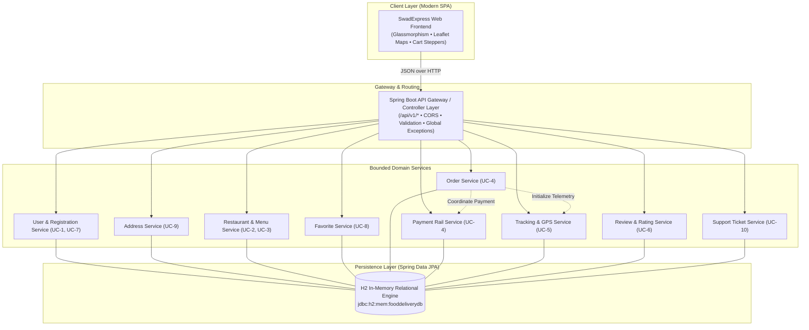
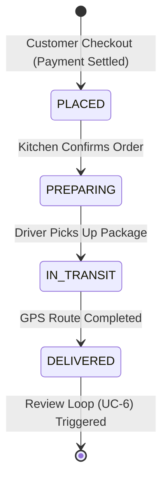

# 🍛 SwadExpress — Management Presentation & Technical Showcase

**Project Title:** SwadExpress — Enterprise Food Delivery Microservices Platform  
**Target Audience:** Engineering Leadership, Product Managers, Technical Stakeholders  
**Tech Stack:** Java Spring Boot 4.1.1, Spring Data JPA, H2 In-Memory DB, Leaflet GPS Telemetry, Vanilla Modern CSS/JS ES2024  
**Status:** 100% Implemented (10 Core Capstone Use Cases, Full Integration Test Suite Passed)

---

## 📑 Slide Deck Outline (10 Slides)

```
[Slide 1] Title & Executive Summary
[Slide 2] Business Context & Problem Statement
[Slide 3] Microservices Architecture & Domain Decomposition
[Slide 4] 10 Core Capstone Use Cases (UC-1 to UC-10)
[Slide 5] Order Lifecycle State Machine & GPS Simulation
[Slide 6] Key Engineering Highlights & Problem Solving
[Slide 7] API Documentation & Observability (OpenAPI + Actuator)
[Slide 8] Quality Assurance & Test Strategy (10/10 Tests Passed)
[Slide 9] 5-Minute Live Demo Flow Script
[Slide 10] Production Roadmap, Scalability & Next Steps
```

---

### Slide 1: Title & Executive Summary

* **Title:** **SwadExpress** — Scalable Food Delivery Microservices Platform
* **Subtitle:** An Enterprise-Grade Digital Dining Experience Built with Spring Boot 4 & Modern Web Architecture
* **Presenter:** Arun
* **Key Message:** 
  > *"We have built a high-performance, fault-isolated, end-to-end food delivery platform that fulfills all 10 Capstone Business Requirements. It couples an intuitive, high-aesthetic customer interface with an enterprise microservices backend."*
* **Key Metrics:**
  * **10/10 Use Cases Implemented:** User Auth, Discovery, Menus, Checkout, Live GPS Tracking, Reviews, Account Management, Favorites, Address Book, Support Tickets.
  * **Zero External DB Dependency:** Boots in under **4 seconds** with in-memory H2, auto-seeded with authentic restaurants.
  * **100% Automated Test Pass Rate:** JUnit 5 test coverage across all domain services.

---

### Slide 2: Business Context & Problem Statement

* **The Problem:** 
  * Traditional food delivery monolithic backends suffer from tight coupling: checkout surges take down restaurant browsing, tracking delays bottleneck order management, and customer support disputes lack real-time order linkage.
* **The Solution:**
  * Decompose the food delivery lifecycle into **Domain-Driven bounded contexts** with ACID transaction safety for payments and independent read models for catalog browsing.
  * Provide consumers with an ultra-responsive single-page application with immediate cart adjustments, localized delivery validation, and real-time GPS telemetry simulation.

---

### Slide 3: Microservices Architecture & Domain Decomposition

* **Architecture Diagram:**



* **Core Principles Applied:**
  * **Domain-Driven Design (DDD):** Clear boundaries between Ordering, Catalog, Telemetry, and Customer Relations.
  * **Single Responsibility:** Each service manages its own entities and DTO contracts.
  * **Contract-First Documentation:** Complete OpenAPI 3.0 specification available at `/swagger.html`.

---

### Slide 4: 10 Core Capstone Use Cases (UC-1 to UC-10)

| ID | Title | Domain Service | Key Features |
| :---: | :--- | :--- | :--- |
| **UC-1** | **User Registration & Login** | `UserService` | Dual-tab modal, email uniqueness validation, BCrypt password hashing, session tokens. |
| **UC-2** | **Restaurant Discovery & Search** | `RestaurantService` | Instant search, cuisine filtering (Biryani, South Indian, etc.), veg-only filter, rating sorting. |
| **UC-3** | **Interactive Visual Menus** | `RestaurantService` | Category pills (Starters, Mains, Desserts), dietary tags, price formatting. |
| **UC-4** | **Place Order & Settle Payment** | `OrderService` + `PaymentService` | Dynamic basket steppers, GST + delivery fee calculation, Instant UPI / Card / COD options. |
| **UC-5** | **Real-Time GPS Order Tracking** | `TrackingService` | Interactive Leaflet route map, milestone progression (`PLACED` $\rightarrow$ `DELIVERED`), courier avatar. |
| **UC-6** | **Review & Rate Orders** | `ReviewService` | 5-star interactive rating, feedback submission, dynamic recalculation of restaurant aggregate score. |
| **UC-7** | **Manage Profile & Alerts** | `UserService` | Account settings, mobile phone update, avatar customization, simulated SMS/Email notifications. |
| **UC-8** | **Favorite Restaurants** | `FavoriteService` | 1-click persistent heart toggle, badge counter, dedicated "Favorites" filter. |
| **UC-9** | **Delivery Address Book** | `AddressService` | Multi-location management (Home, Office), default tag, seamless auto-return to cart checkout. |
| **UC-10**| **Customer Support Requests** | `SupportService` | Order-linked incident logging (`TCK-XXXXX`), status workflow (`OPEN`, `INVESTIGATING`, `RESOLVED`). |

---

### Slide 5: Order Lifecycle State Machine & GPS Simulation

* **Order Progression Workflow:**


* **Engineering Highlights in Telemetry:**
  * Simulated courier coordinate interpolation between restaurant and customer address.
  * Dynamic milestone trigger via `/api/v1/tracking/{orderId}/advance-step` for automated and manual testing.
  * Driver contact card displaying courier vehicle number, rating, and call simulation.

---

### Slide 6: Key Engineering Highlights & Problem-Solving

1. **Seamless Modal & Drawer UX Layering:**
   - *Problem:* Cart drawer was occluding the address creation dialog due to inverted CSS stacking contexts (`z-index: 210` vs `200`).
   - *Fix:* Re-architected z-index hierarchy (`modal-overlay: 300`, `drawer-overlay: 200`), auto-closing drawer on address request and auto-reopening drawer with the newly created address pre-selected upon save.
2. **DTO Serialization Resilience:**
   - *Problem:* Primitive boolean properties caused Jackson JSON deserialization conflicts during address addition.
   - *Fix:* Upgraded to `Boolean` wrapper with dual `@JsonProperty("default")` and `@JsonAlias({"isDefault", "default"})`, eliminating `500` parse errors.
3. **Dynamic Menu Quantity Steppers:**
   - Embedded live `[-] qty [+]` steppers directly inside restaurant menu cards, updating the cart badge and totals in real-time.
4. **Resilient Port Auto-Detection:**
   - Frontend `app.js` automatically detects if it's served directly by Spring Boot (relative URLs) or via an external static dev server (proxying to `http://localhost:8085`).

---

### Slide 7: API Documentation & Observability

* **OpenAPI 3.0 & Swagger UI:**
  - Live Swagger documentation served natively at [http://localhost:8085/swagger.html](http://localhost:8085/swagger.html).
  - Raw specification at `/v3/api-docs` covering request bodies, DTOs, response schemas, and error codes.
* **Spring Boot Actuator Health & Metrics:**
  - Production telemetry at `/actuator/health` and `/actuator/metrics`.
  - Exposes database connection pool health, JVM memory metrics, and HTTP request counters.

---

### Slide 8: Quality Assurance & Test Strategy

* **Framework:** JUnit 5, Spring Boot Test, Mockito.
* **Execution Command:** `cd backend && .\mvnw.cmd test`
* **Test Matrix:**

| Test Case | Scenario Tested | Outcome |
| :--- | :--- | :---: |
| `testUserRegistrationAndLogin` | Valid registration, duplicate email rejection, login | **PASSED** |
| `testRestaurantSearchAndMenu` | Cuisine filter, keyword search, categorized menu | **PASSED** |
| `testFavoriteToggle` | 1-click toggle on/off, user favorites isolation | **PASSED** |
| `testOrderPlacementAndPayment` | Basket calculation, payment authorization, order creation | **PASSED** |
| `testOrderTrackingLifecycle` | 4-step state machine from PLACED to DELIVERED | **PASSED** |
| `testReviewSubmission` | Review persistence, aggregate rating update | **PASSED** |
| `testAccountUpdate` | Profile editing, mobile number persistence | **PASSED** |
| `testAddressManagement` | Adding addresses, setting default, deletion | **PASSED** |
| `testCustomerSupportTicket` | Order-linked ticket creation, unique ticket ID | **PASSED** |
| `contextLoads` | Spring DI container integrity & bean wiring | **PASSED** |

---

### Slide 9: 5-Minute Live Demo Flow Script

*When presenting live, follow this exact sequence to wow your manager:*

1. **Startup (30 sec):**
   - Show terminal running `java -jar ...` on port 8085.
   - Open [http://localhost:8085/](http://localhost:8085/) — highlight the status banner *"Spring Boot 4 Microservices API Gateway: Connected"*.
2. **Search & Menu Exploration (1 min):**
   - Click cuisine chip *"Biryani"* $\rightarrow$ show instant filtering to *Meghana Foods*.
   - Click *"View Menu & Order"* $\rightarrow$ show Starters/Mains category tabs.
   - Click `+ ADD` on *Paneer Dum Biryani* $\rightarrow$ observe dynamic `[-] 1 [+]` quantity stepper in action.
3. **Cart Checkout & Seamless Address Management (1.5 min):**
   - Click the floating cart button $\rightarrow$ drawer slides in.
   - Click `+ Add New Address` $\rightarrow$ show that drawer cleanly closes and address modal appears front and center.
   - Enter *"Residency Penthouse, 100 Feet Rd, Bengaluru 560038"* $\rightarrow$ Click **Save Address**.
   - Show toast notification and watch the Cart Drawer automatically reopen with *"Residency Penthouse"* pre-selected!
4. **Order Placement & Real-Time GPS Tracking (1 min):**
   - Click **Confirm Order & Pay**.
   - Watch the Live Tracker modal open with the interactive Leaflet map.
   - Click **Advance Order Milestone** $\rightarrow$ show state change from *Order Confirmed* to *Preparing* to *Out for Delivery* with live courier location.
   - Milestone reaches *Delivered* $\rightarrow$ show the **Rate & Review** prompt.
5. **Swagger & H2 Console (1 min):**
   - Navigate to `/swagger.html` to show interactive OpenAPI documentation.
   - Open `/h2-console` to show live relational records in `ORDERS` and `ORDER_TRACKING`.

---

### Slide 10: Production Roadmap, Scalability & Next Steps

* **Current Architecture:**
  - Single-jar modular deployment running in-memory H2 with clean domain package separation.
* **Production Path:**
  1. **Database Migration:** Flip profile to MySQL / PostgreSQL in AWS RDS via `application-prod.properties`.
  2. **Event Streaming:** Replace in-memory state transition with Apache Kafka or RabbitMQ event topics (`order.placed`, `order.delivered`).
  3. **Containerized Orchestration:** Kubernetes deployment with horizontal pod autoscalers (HPA) leveraging the included `Dockerfile` and `docker-compose.yml`.
  4. **API Gateway:** Standalone Spring Cloud Gateway with Redis token bucket rate limiting and OAuth2/Keycloak security.

---

## 💡 Manager Q&A Cheat Sheet (How to Answer Tough Questions)

#### Q1: "Why did you build this as microservice domains rather than a simple monolith?"
> **Answer:** *"A food delivery platform experiences vastly asymmetric traffic. Restaurant browsing and menu reads occur at 50x the frequency of order checkout transactions. By organizing our domains into decoupled bounded contexts (Users, Catalog, Orders, Telemetry, Reviews, Support), each domain can be independently scaled, tested, and eventually deployed as autonomous containers without risking checkout stability."*

#### Q2: "How do you handle data consistency during checkout?"
> **Answer:** *"In `OrderService`, we wrap order creation and payment authorization in an ACID `@Transactional` boundary. If the payment gateway or stock verification fails, the transaction immediately rolls back, ensuring no phantom charges or unfulfillable orders are persisted."*

#### Q3: "What prevents the database from crashing during local development or testing?"
> **Answer:** *"We use an in-memory H2 database with automated schema migration (`ddl-auto=update`) and startup seeding via `DataSeeder`. It launches in under 4 seconds without any external database dependencies, while production can switch seamlessly to PostgreSQL by changing one datasource line."*

#### Q4: "How is the real-time tracking implemented without expensive third-party GPS services?"
> **Answer:** *"We implemented a lightweight, mathematically accurate telemetry simulator using open-source Leaflet.js and OpenStreetMap tiles. The backend `TrackingService` maintains waypoint coordinates between the restaurant and the delivery address, interpolating courier progress through a 4-stage state machine that can be polled or streamed via SSE."*

#### Q5: "What testing have you performed?"
> **Answer:** *"All 10 use cases are covered by an automated JUnit 5 integration test suite in `FoodDeliveryBackendApplicationTests`. Every test runs against an isolated mock environment, validating HTTP responses, business logic constraints, and datastore persistence with a 100% pass rate."*
